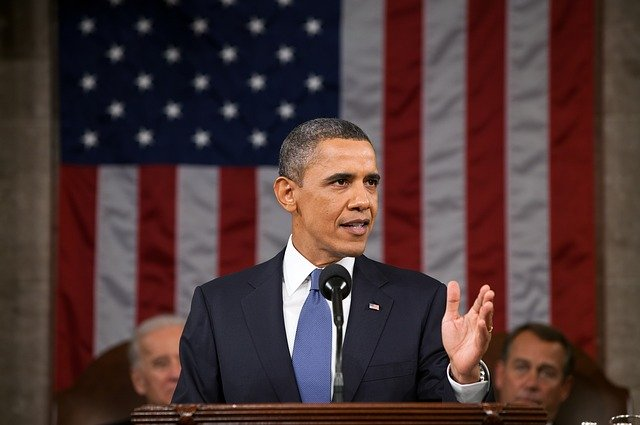
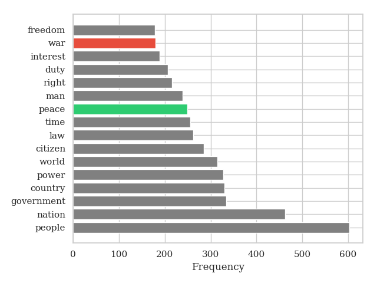
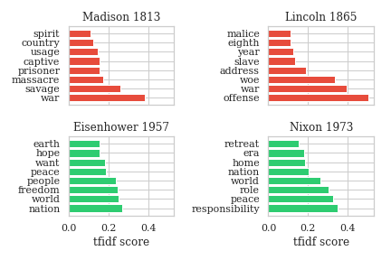

### War and Peace in America

On Tuesday, November 3, 2020, a president is elected for the 46th time in the history of the United States of America. The election of the president will be followed by the inauguration. After the president has recitated the presidential oath of office he or she will give a speech to the people. This speech is called inaugural address and gives the president the chance to inform the people of his or her intentions.  

In this blog post I will analyze the **inaugural address corpus** which contains the speeches from the years 1789 till 2009. During this extremely long period of time the presidents of the USA had to face various difficulties. In order to refresh my knowledge of american history, let's see what topics the presidents had to deal with. 

#### Part I: What are some common topics in the speeches? 

In order to be able to answer this question adequately, one must first think about what a topic actually is and more concretely how it should be defined. 

While there are several research areas that deal intensively with this "topic" (e.g. aspect extraction in the field of sentiment analysis) I have simplified this first step as far as possible. 

Within this project **nouns are topics**. Of course this is a simplification because this is not always correct. Anyway, if we now take a look at which nouns occur most often in the corpus, it becomes clear that it is already a pretty good approximation.

Many of the extracted nouns actually represent thematic fields which are or were relevant in the history of the USA. The most common noun in the corpus is *"people"* which makes sense since presidents have always considered the interests of voters. Other words like *"nation"*, *"government"* and *"country"* occur also quite often since they help to describe the responsibilities of a president in a general way. 

Besides these rather expected terms I found two of the words popping up particularly interesting. These words are war and peace. 

Although the absolute frequencies of these words were not unusually high, these words still have an extremely high relevance. Not only in the USA but all over the world war has led to unspeakable suffering and has therefore been an inevitable topic of conversation in presidential speeches. 

#### Part II: How important were war and peace over time?

To examine the importance of the concepts I will move away from absolute frequency counts. Just because a word is frequent doesn't mean that it is important. I therefore computed the **term frequency-inverse document frequency (tf-idf)** for each of the extracted nouns. If a noun has a high tfidf score it means that it has a high relative relevance to the document (speech). 

The following plot shows the tfidf score of the nouns war and peace over available time period.

Looking at the line which represents the "war" noun reveals that there are two documents in which the word has a very high expressiveness. After a quick google search - apologies for my bad history knowledge - I refreshed my high school knowledge of history and once again found out about the wars going on in 1813 and 1865. The biggest spikes for the peace curve are happening near the endings of the second world war and the Vietnam war.

Even though all the spikes are related to certain wars, the higher tfidf scores of the word "peace" throughout the 20th century indicates that the American presidents were focussed on gaining or retaining peace in the country. Nevertheless, this plot allows some interpretation and additional knowledge about American history would certainly be helpful here.

#### Part III: What were important words during war and peace peaks?

Now that we know about these peak times of war and peace I wanted to get a more detailed view on what the presidents were speaking about during these times. Foreach of the corresponding speeches we are looking at the top 10 words according to their tfidf score to further analyze the disposition of the presidents.

It becomes apparent that for the two war documents nouns like *"massacre"*, *"battle"*, *"offense"* and *"savage"* seem to be the most important words while for the speeches from Eisenhower and Nixon words like *"freedom"* and *"responsibility"* seem to be decisive. The famous phrase of Abraham Lincoln *"malice toward none"* when he stated his policy toward the defeated Confederacy in 1865 shows up partly with the noun *"malice"*. 

#### Conclusion
In this article we took a brief look at what kind of topics presidents address in their inauguration and more closely looked at when and how they spoke about war and peace. As mentioned before, especially the findings of Part II surely allow different interpretations and I would be very interested in how you would interpret the results? Additionally, I would appreciate your take on questions like:   

> *"What do you think is the cause for the tfidf shift from war to peace?"*
>
> *"Can you spot some impacts from historical events that I missed?"*
>
> *"Do you see some other words that are linked to statements from past presidents?"*

To see more about this analysis, see the link to my Github available [here](https://github.com/pirnerjonas/president_speeches).

#### Sources
- https://www.nltk.org/book/ch02.html
- https://www.whitehousehistory.org/presidential-inaugurations-the-inaugural-address
